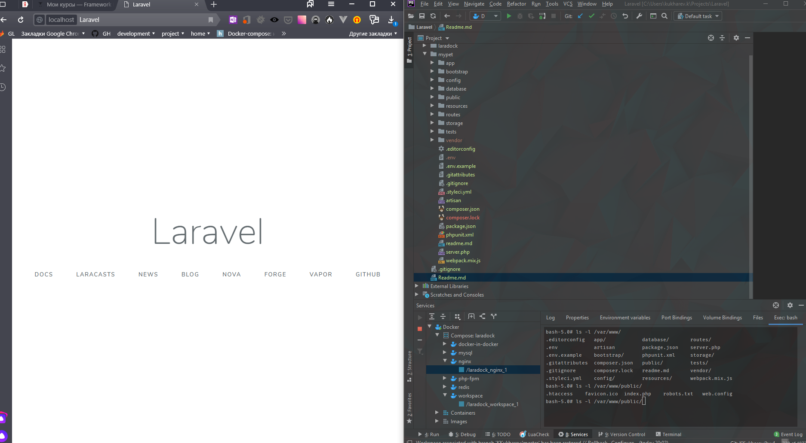

##hello world

##Проект
Сервис составления списка покупок в продуктовом магазине и меню. 
Возможные кейсы:
1. Планируем меню по блюдам на неделю - получаем список покупок на неделю (исходя из времени и условий хранения)
2. Список покупок в телеграмм
3. Заполняем список того что есть в холодильнике - получаем список блюд, которые можем приготовить
4. фильтры (стоп-лист) на блюда с алергенами. как вариант - телеграмм бот - поиск ("можно ли мне это съесть")
5. Варианты меню на день-неделю (эконом, вегетерианское, детское, новогоднее, национальное, по каллориям, ЖБУ)