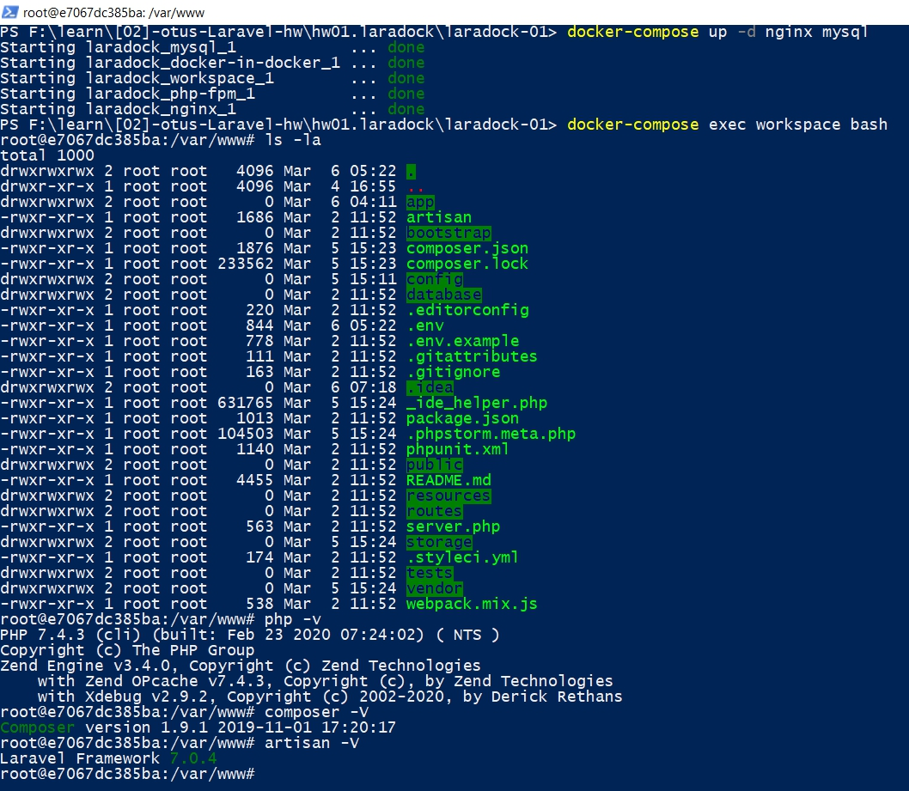
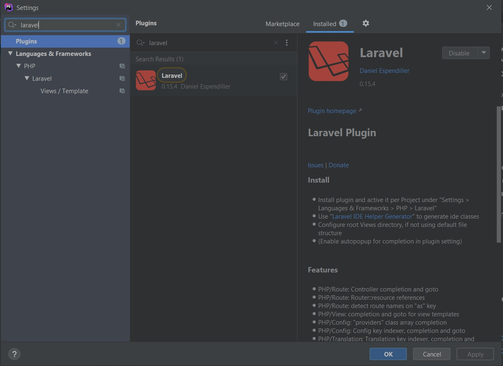
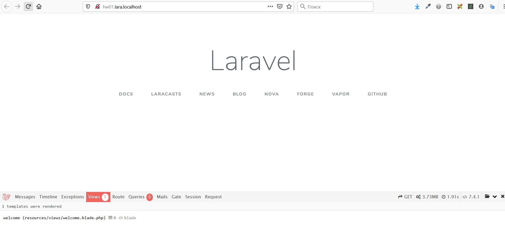

# Домашнее задание к уроку №01

## Рабочая среда для фреймворка и будущий проект

### Цель:
* Сделать самые первые шаги в освоении нового инструмента.
* Развернуть рабочую среду для будущих заданий.
* Определиться с целевым проектом на время изучения

1. Необходимо подготовить среду для дальнейшей разработки. Разрешается использовать Homestead или Laradock. Развернуть фреймворк у себя в выбранной среде. В качестве ДЗ можно сдавать скриншот рабочей среды.

2. Выбрать цель для курсового проекта из нижепредложенных или предложить свою:
    * Новостной портал
    * Доска объявлений
    * Сервис ToDo
    * Telegram-бот поиска информации по конструкциям выбранного языка (PHP, Go, C и т.д.)
    * Сайт знакомств 1 занятие

Выбрать проект.
Оповестить преподавателя.
Обосновать выбор.

## Решение
1. Подготовка среды:
    * Подготовил среду с использованием Laradock 
    * Установил:
        * https://github.com/barryvdh/laravel-ide-helper
        * https://github.com/barryvdh/laravel-debugbar/
        * Плагин Laravel для PhpStorm 
    * Проверил, что сайт на Laravel в базовой установке запускается 

2. Выбор проекта.
    
###Управленческий и финансовый учёт для проектного бизнеса

#### Клиент

IT-компания занимющаяся проектированием и установкой систем безопасности (СКУД, СУРВ, видеонаблюдение, пожароохранная сигнализация), сетей ЛВС, СКС.   

#### Проблемы, которые приложение дожно помочь решить
    
1. Не поставлен учёт поступления и расхода финансов по проектам. В результате этого владелец не знает сколько у него свободных денег и не может планировть закуп товара.
2. На данный момент менеджеры по продажам получают процент с оборота от проектов, которые они ведут. В результате вся стратегия продаж сводится к понижению цены, что негативно сказывается на прибыльности бизнеса. Решено перевести продажников на процент с прибыли, при этом увеличив процент. Для этого необходима более прозрачная система учёта финансов и оборудования в проектах.
3. На данный момент учёт и планирование по направлению монтажников на работы ведётся в экселе и блокноте у начальника отдела монтажников. В результате у компании неясная картина по трудовым ресурсам, трудно определить какой объём заказов и в какие сроки можно выполнить.