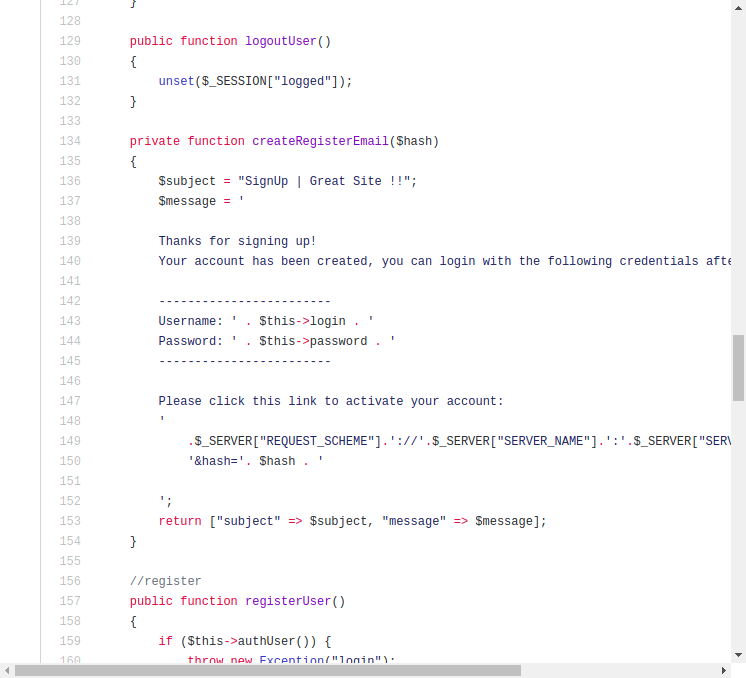
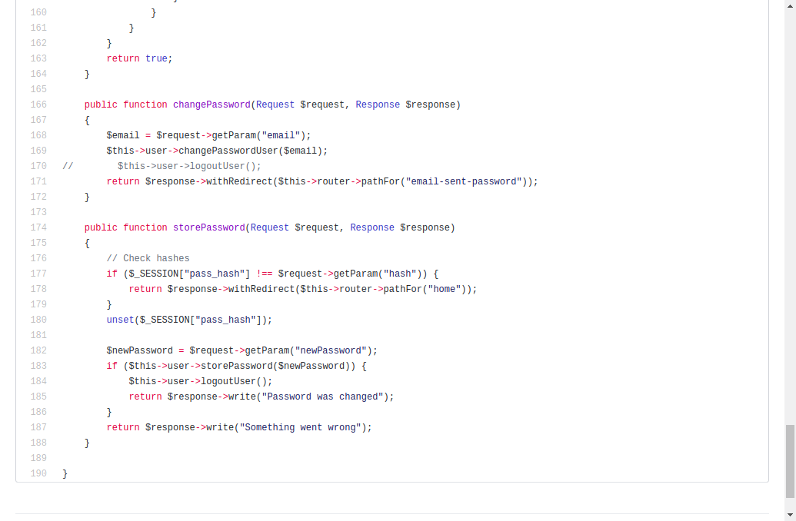
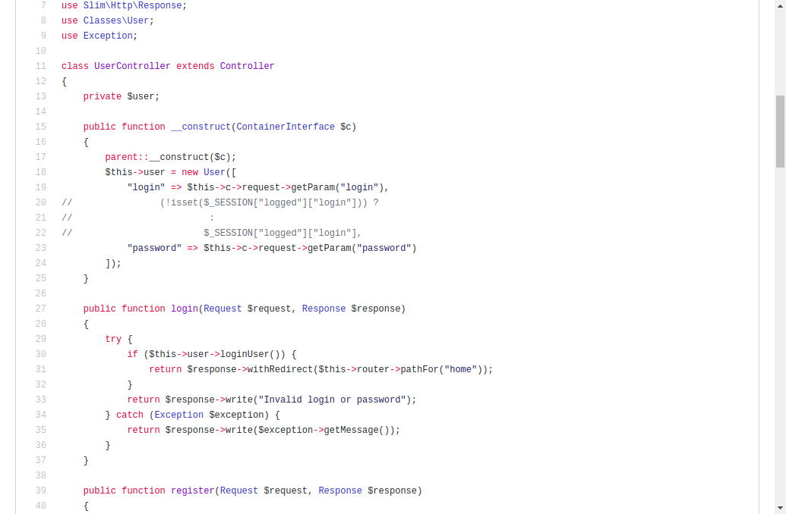
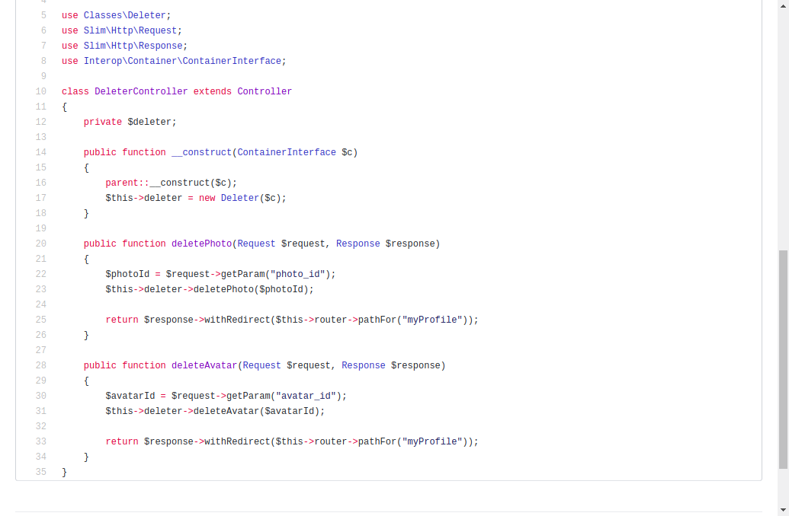
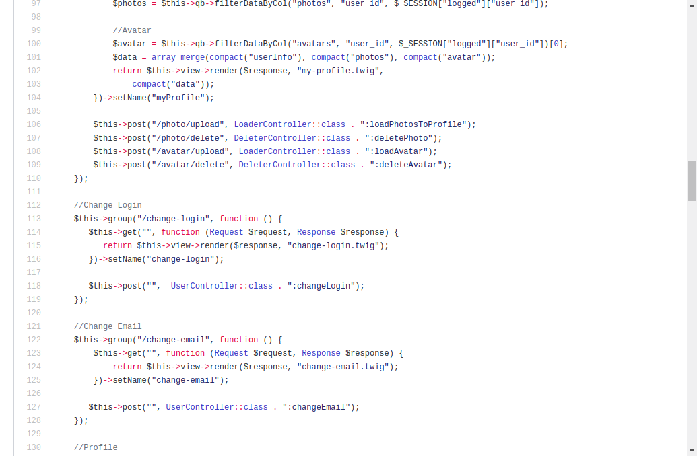
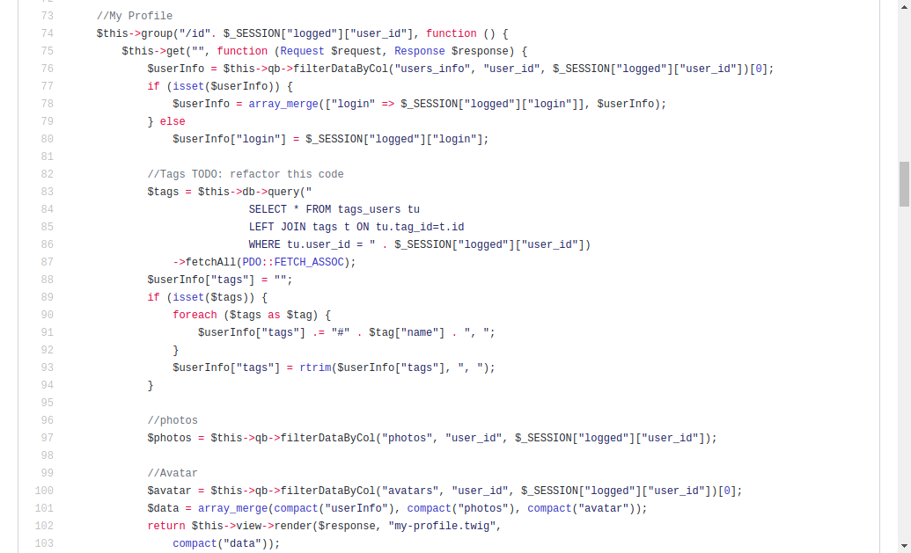

# SOLID Principles with examples

**The project's url: https://github.com/koliankolin/matcha** 

#### SOLID
* **The Single Responsibility Principle**

1. There is a method createRegisterEmail in class User but it should be separate
class Emailing or smt like that

2. In class UserController there are two unsuitable methods 
which change login and password. It should be done with DI another class Changer for instance

* **The Open/Close Principle**
Method loginUser in class user should implement interface with login, isAdmin and logout.
Also it could be abstract class because the implementation of logout is the same.
An Implementation of login method must check is admin current user or not and gives 
different role.

* **The Liskov Substitution Principle**
1. In UserController it should be used in constructor UserInterface to allow other different
users' types.
Screenshot as the previous one.

2. It should be injected interface of Deleter in DeleterController and 
also create different classes for DeleterPhoto, DeleterUser and so on which
implement DeleterInterface. After that different Deleters classes can be injected in
DeleterController for different purposes.

* **The Interface Segregation Principle**
It can be class Validator and it can implement ValidateByVk, ValidateByOk, ValidateByEmail
and so on.

* **The Dependency Invertion Principle**
This principle is broken in all my controllers because of creation each time new class.
Maybe it could be useful to do that with pattern Factory to create different objects.

#### KISS

This place of code is the simplest place in project. All logic was hided in 
controllers and it's only necessary to call appropriate method of controller.

#### DRY
There are a lot dry in that project. It can be latent and not hidden at all.
 