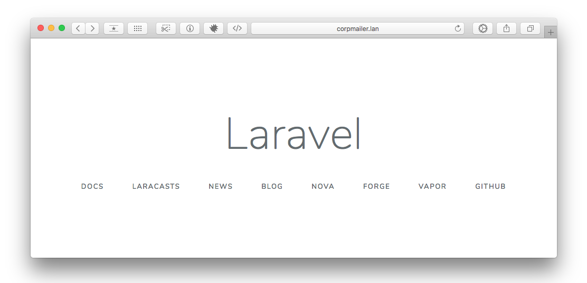
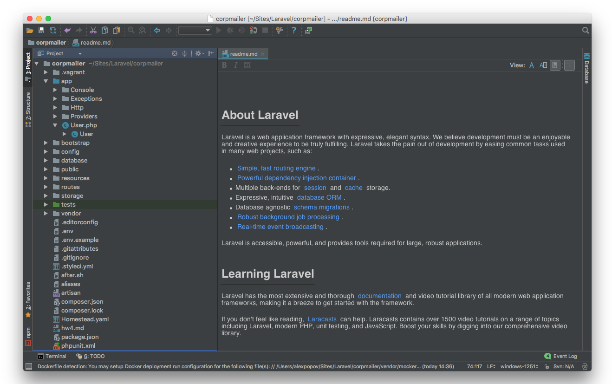

#### 1. Рабочая среда для фреймворка и будущий проект

##### Установка Laravel и Homestead локально для проекта

```
[popov-alexey-mac-2-185% laravel new corpmailer
Crafting application...
...
[popov-alexey-mac-2-185% cd corpmailer 
[popov-alexey-mac-2-185% composer require laravel/homestead --dev
...
[popov-alexey-mac-2-185% php vendor/bin/homestead make
Homestead Installed!
[popov-alexey-mac-2-185% vagrant up
```

##### Конфигурация Homestead

```yaml
ip: 192.168.10.10
memory: 2048
cpus: 2
provider: virtualbox
authorize: ~/.ssh/id_rsa.pub
keys:
    - ~/.ssh/id_rsa
folders:
    -
        map: /Users/alexpopov/Sites/Laravel/corpmailer
        to: /home/vagrant/code
sites:
    -
        map: corpmailer.lan
        to: /home/vagrant/code/public
databases:
    - homestead
features:
    -
        mariadb: false
    -
        ohmyzsh: false
    -
        webdriver: false
name: corpmailer
hostname: corpmailer
``` 

В файл /etc/hosts добавляем запись
```
192.168.10.10   corpmailer.lan
```

Тадаааа... )))





#### 2. Цель курсового проекта

Тема курсового проекта - **Корпоративный рассыльщик почты**

В работе _Рекламного отдела_ отдела часто приходится отправлять
письма для большого числа получателей - коллеги из других филиалов,
менеджеры, руководство, бухгатлера. 
##### Стоит задача сделать систему позволяющую:
- добавлять/импортировать корпоративные Email-ы с ФИО, должностями, городами и т.д.
- создавать smart-группы по разным признакам или объединять в группы вручную
- создавать/редактировать и сохранять в конструкторе шаблоны для рассылок
- создавать новые и повторять отправленные рассылки 
- отправлять рассылки по расписанию расписанию
- реализовать API с файлообменниками для прикрепления к письмам больших вложений.

Планов громадьё, надеюсь что-нибудь да и получится ))
     
